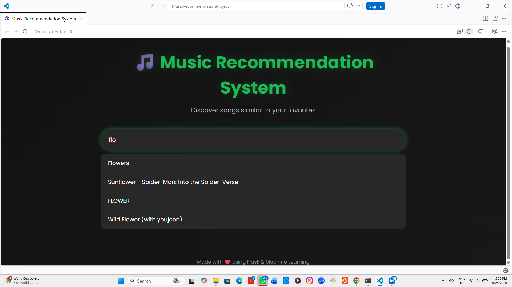
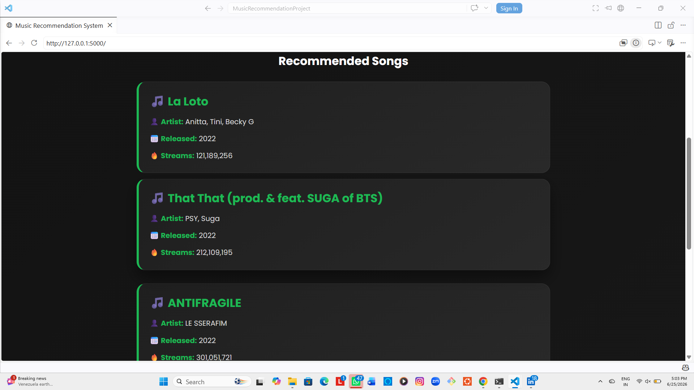
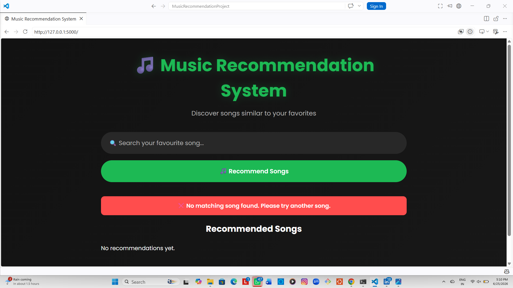

# 🎵 Music Recommendation System

A Flask-based Music Recommendation System that recommends similar songs using **Content-Based Filtering** and **Cosine Similarity**.

---

## 🚀 Features

- 🎵 Music Recommendation using Machine Learning
- 🔍 Partial Song Search
- ⚡ Live Autocomplete Suggestions
- 📊 Cosine Similarity Recommendation Engine
- 🌐 Flask Backend
- 🎨 Responsive User Interface
- ❌ Error Handling for Invalid Searches

---

## 🛠️ Tech Stack

- Python
- Flask
- Pandas
- Scikit-learn
- HTML
- CSS
- JavaScript

---

## 📂 Project Structure

```
MusicRecommendationProject/
│
├── app.py
├── recommendation.py
├── clean_spotify.csv
├── requirements.txt
├── README.md
├── .gitignore
│
├── static/
│   ├── css/
│   ├── js/
│   └── images/
│
├── templates/
│   └── index.html
│
└── screenshots/
```

---

## 📸 Screenshots

### 🏠 Home Page


---

### 🔍 Live Autocomplete



---

### 🎵 Song Recommendations



---

### ❌ Invalid Song Search



---

## ⚙️ Installation

Clone the repository

```bash
git clone <repository-url>
```

Move into the project

```bash
cd MusicRecommendationProject
```

Install dependencies

```bash
pip install -r requirements.txt
```

Run the application

```bash
python app.py
```

Open in your browser

```
http://127.0.0.1:5000
```

---

## 📈 Future Enhancements

- 👤 User Authentication
- ❤️ Favorite Songs
- 🎵 Playlist Management
- 🗄️ MySQL Database
- ☁️ Deployment

---

## 👩‍💻 Author

**Sinchana Shetty S**

Electronics & Communication Engineering Graduate

Python Full Stack Developer
